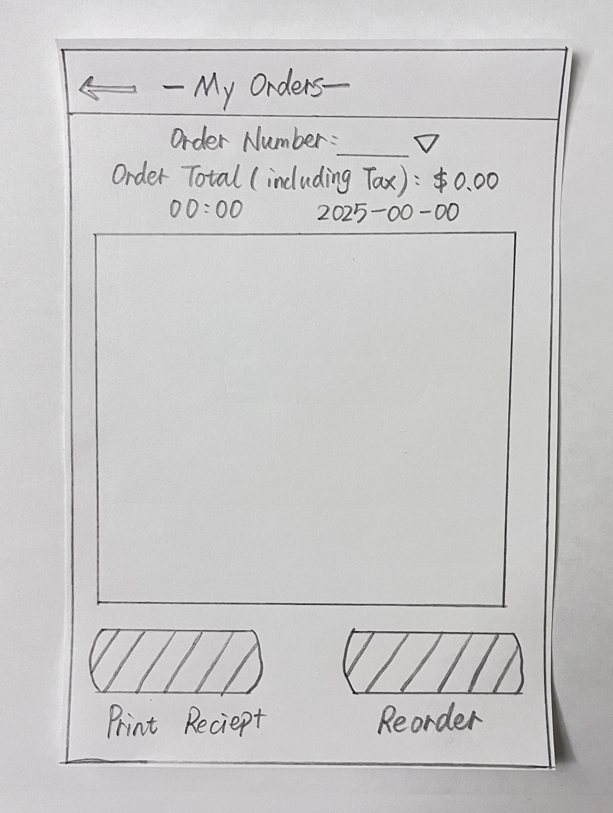
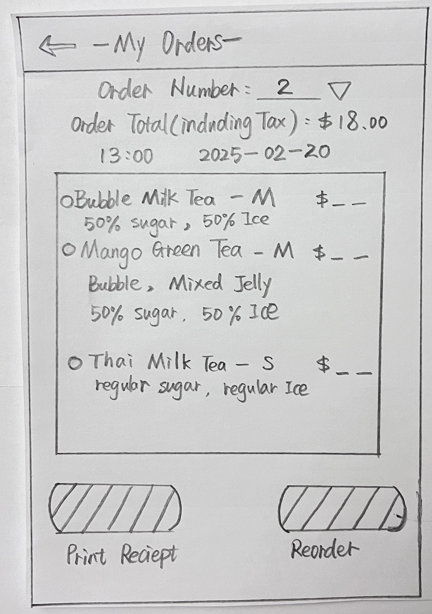
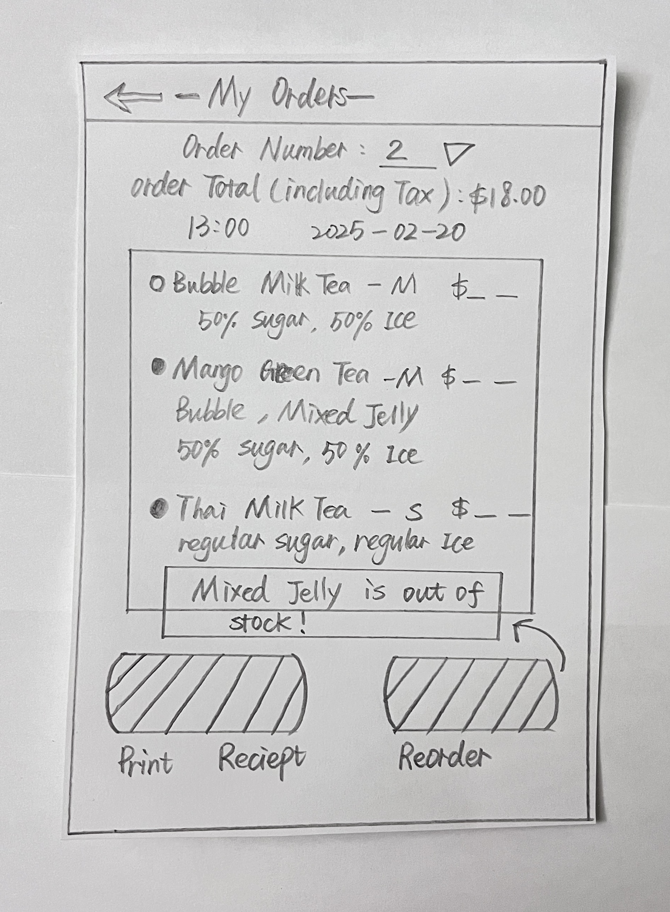

# Storyboard: View and Reorder Past Orders  

## **User Story**
As a customer using the App,  
I want to access my past orders from the homepage and reorder drinks,  
So that I can quickly track my purchases and effortlessly reorder my favorite drinks.

---

## **Step 1: Access the My Orders Page**
- The user opens the app and taps on **"My Orders"** from the homepage.  

---

## **Step 2: View Past Orders**
- The user sees a list of their **past orders**.  

- If no past orders exist, an **empty list** is displayed.  

---

## **Step 3: Search for a Past Order**
- The user enters an **order number** in the search bar to find a specific past order.  

- The user should see only the matching order displayed

  
- if the order number does not exist, the user should see the message "Order not found" 

---

## **Step 4: Select an Order for Reordering**
- The user selects a **previously placed order** they want to reorder, also tap the "Reorder" button  

- The system checks the **availability of all items**.  
- The user should see a confirmation message "Your drinks have been added to the cart!" 

---

## **Step 5: Handle Out-of-Stock Items**
- If an item is **out of stock**, the system shows a warning message - "items are out of stock".  
- The user can **proceed with available items** or **unselect the items to cancel the reorder**.  

---

## **Step 6: Order Successfully Added to Cart**
- The user taps the "Reorder" button again, and the order is successfully **added to the shopping cart**.  
- The user sees a confirmation message **"Your updated order has been added to the cart!"**  

