# Storyboard: View edit and Order 

## **User Story**
As a customer,
I want to view the listed products I have added to the cart,
So that I can edit the product, remove it from the list and confirm my purchase.
[User Story](../../features/shopping-cart.feature)

## **Scenario: view product in shopping cart**
- The client opens the app and taps  **"Shopping Cart"** from the homepage.

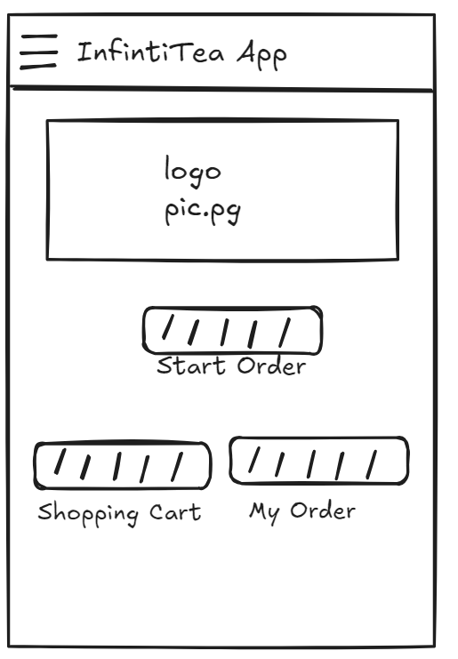

-The user should see listed of product that were added by the user and with detail for each product .

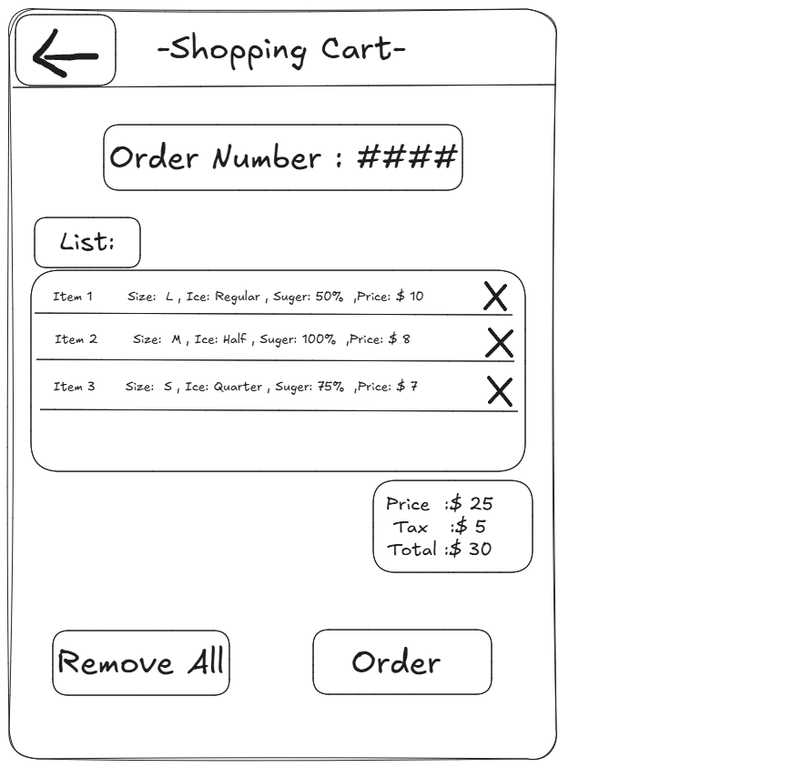

-If no product were add to the cart , it will display Empty in the list

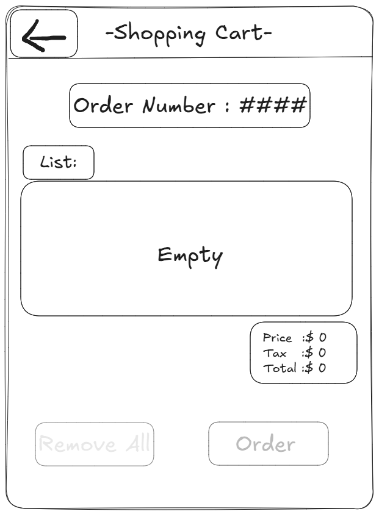

---

## **Scenario: Edit products through the shopping cart**

-I am on the shopping cart page

-I click a product listed in the cart

-Then I will be redirected to the "My Orders" page with the pre-recorded details of the product

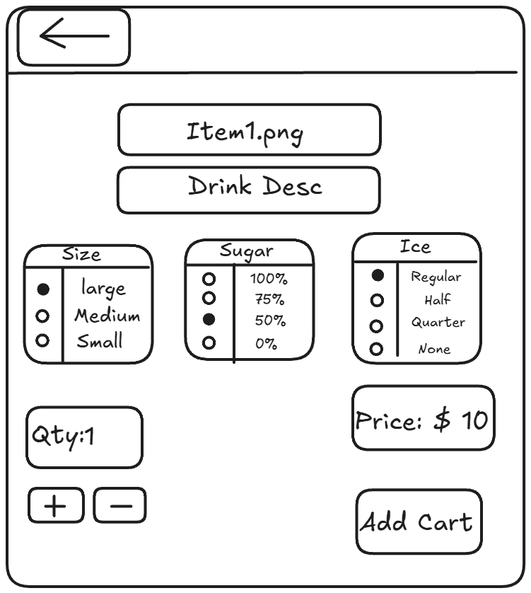

-Then if I change the size from Large to Small and click the "Add to Cart" button
 
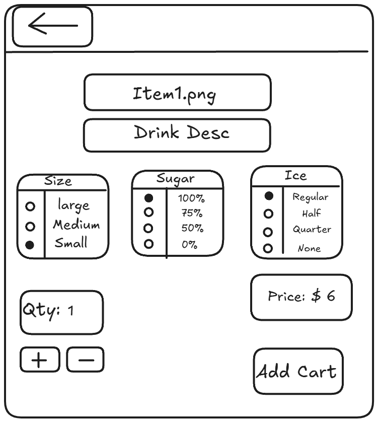

-Then the change will be immediately updated in the shopping cart

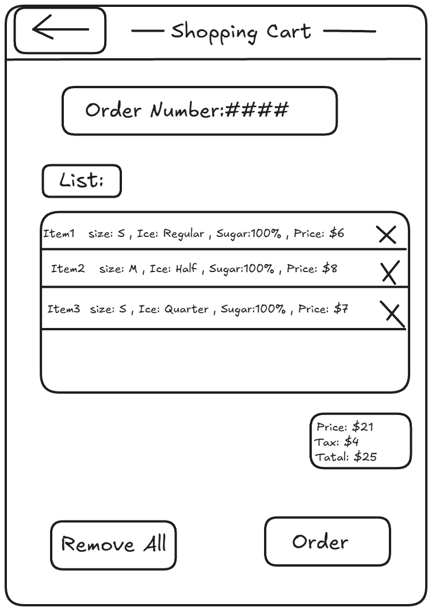

- But if I make the change but do not click the "Add to Cart" button and instead click the back arrow

---

## **Scenario: Remove a product from the list**

-I'm on the Shopping cart

-I click the "X" mark on the right-hand side of the product

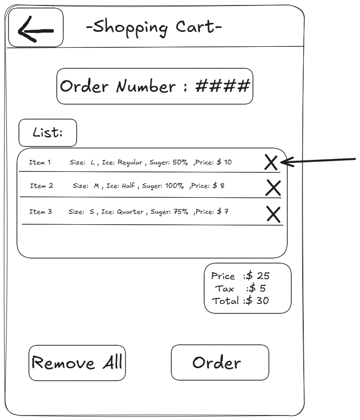

-A confirm message will pop up and ask "Sure to remove?"

-Then I click confirm button

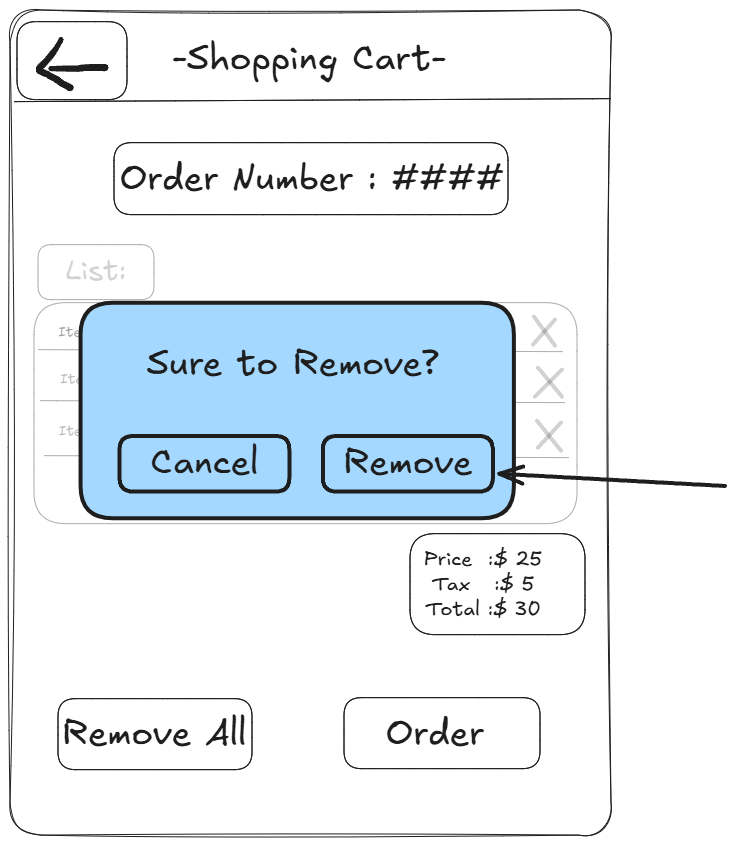

-Then the product should be removed from the list

-And the update will be applied to the cart  

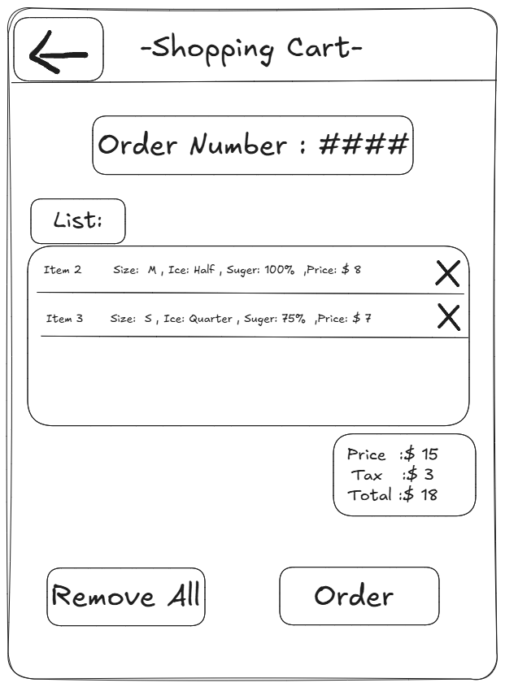

-And if click cancel button  

-Then not change were made

---

## **Scenario: Remove All product at one click **

-I am on the shopping cart

-When I click the "Remove All" button

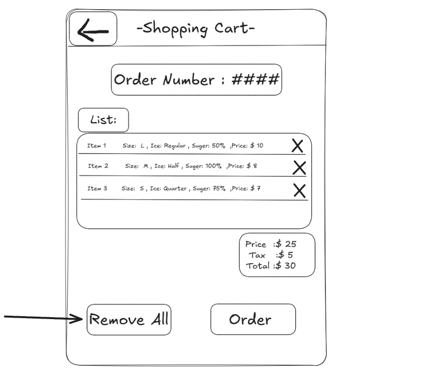

-Then a confirm message will pop up and ask **"Sure to Remove All"**
-When user click confirm button

-Then all the products on the list will be removed

-And the change will be updated

---

## **Scenario: Confirm order **

-I am on the shopping cart

-When I click the **"Order"** button

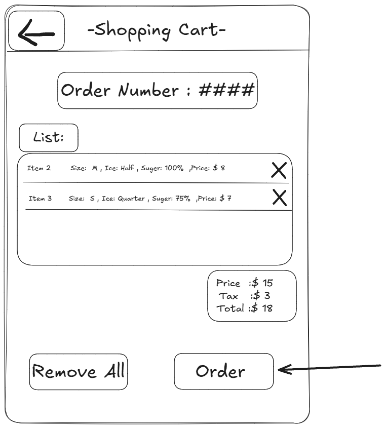

-Then a message will be pop out say "Order Confirm "

- i click the "confirm " button

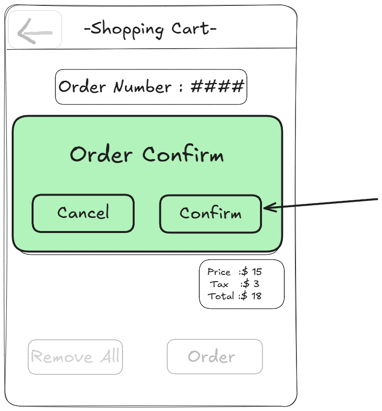

-Then a "Successful" message will pop out
 
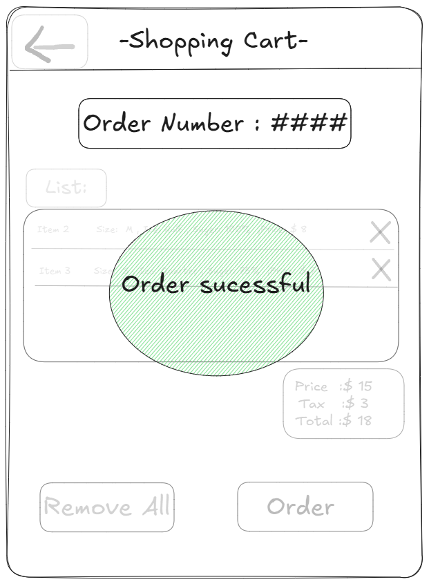

-Then i will be direct to a page that show the detail of the order 

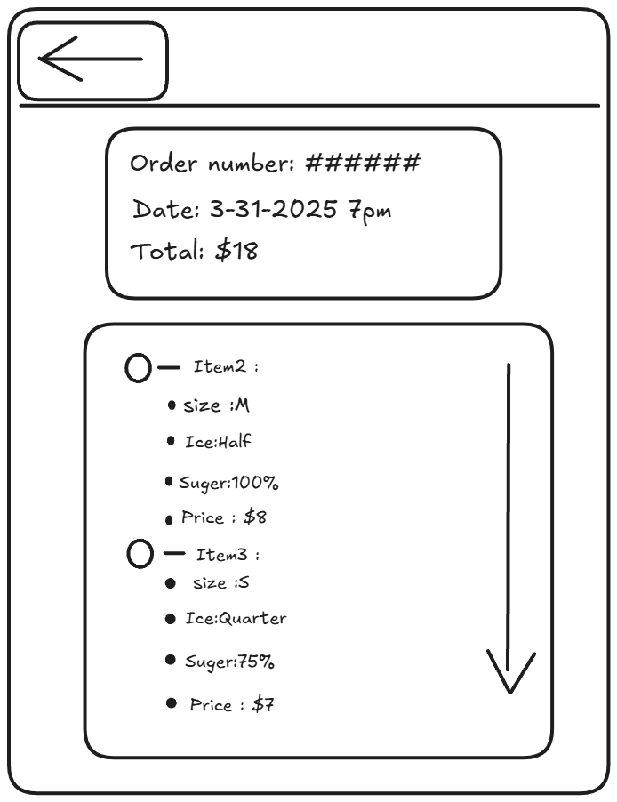

-Then 10 second later i will be automatically direct back to the Home page

