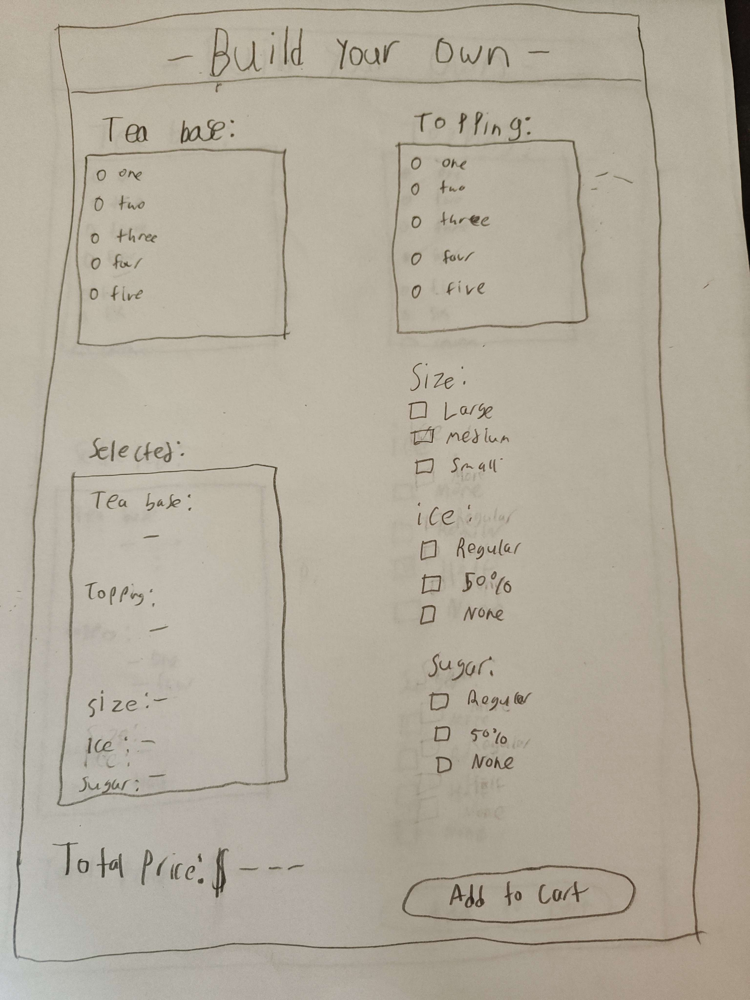
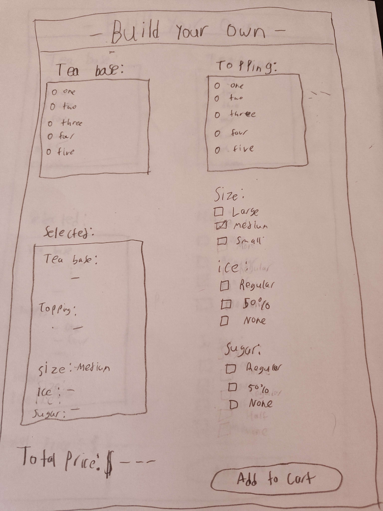
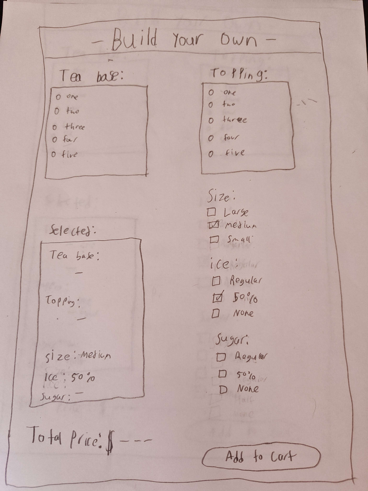
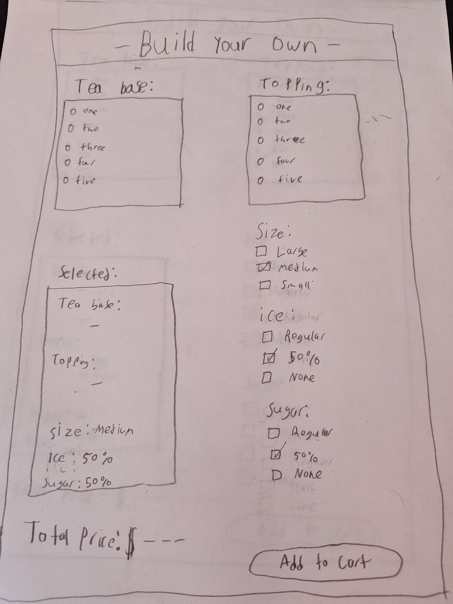
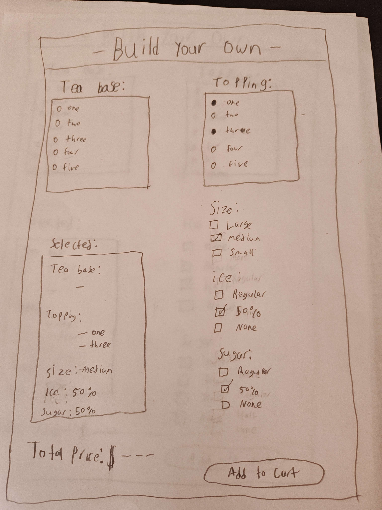
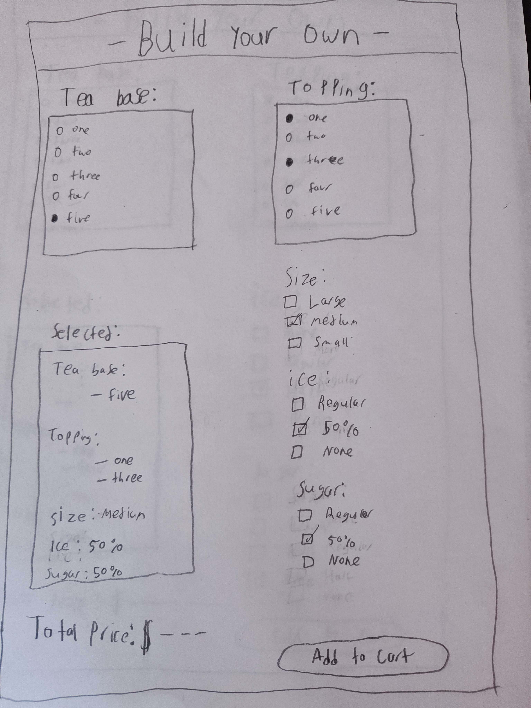
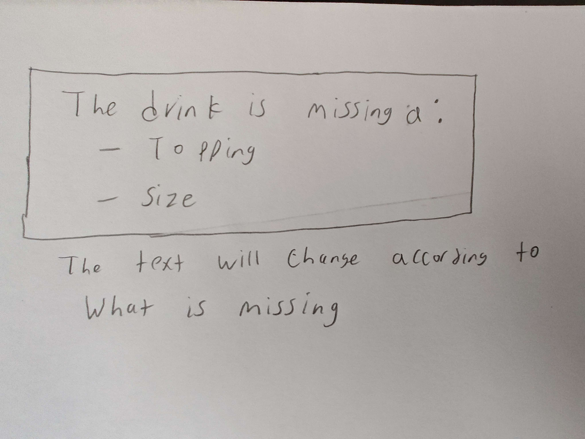

# Storyboard: Build your own drink

## **User Story**
 As a customer,
 I want to customize my own drink,
 So that I can build my favorite drink within 5 minutes.
[User Story](../../features/build.feature)

## **Step 1: Access the Build Page**
- The user opens the app and taps on **"My Orders"** from the homepage.  

- Then the user will tap on **"Build your Own"** from the menu page.

---

## **Step 2: Customize drink selectables**
- The user sees a **selectable** options to customize their desired drink. Additionally they can select options such as **size**, **sugar**, and **ice** of their drink. 

- The user will select the drink size.

- The user will select the amount of ice.

- The user will select the sugar level.

- The user will select the topping(s).

- The user will select the tea base.

---

## **Step 4: Add to Cart**
- The user clicks **add to cart** then their drink appears on the **Shopping Cart**

- if the user clicks **add to Cart** without selecting a **Tea base**, **Topping**, **Size**, **Ice**, or **Sugar**

---

## **Step 5: Order Confirmation**
- The user clicks **place Order**, then a pop-up appears asking users if they are sure.

- The user sees a **Green Success** screen.

-The user sees their **Order Details**.
