# Storyboard: Order menu item

## **User Story**
As a customer,  
I want to order a classic drink/s online,    
So that I can avoid long wait times and recieve my menu drink within 5mins.  
[User Story](../../features/classic-order.feature)

## **Scenario: Ordering menu drink**
- The user opens the app and taps on **"My Orders"** from the homepage.  

- The user sees a list of **classic drink items on the menu**.  
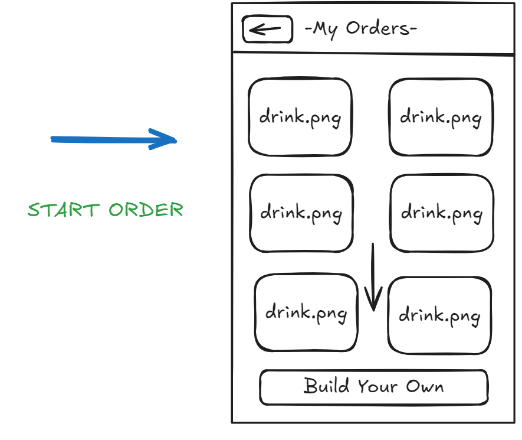

- The user sees a **description** of their selected drink. Additionally they can select options such as **size** of drink, the amount of **sugar** and **ice**.   
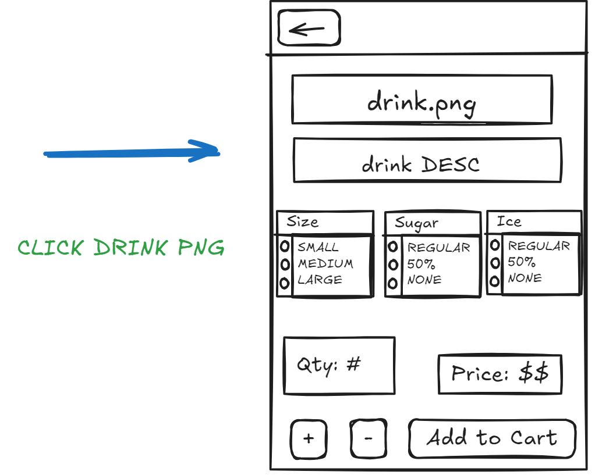

- The user clicks **add to Cart** then their drink appears on the **Shopping Cart**
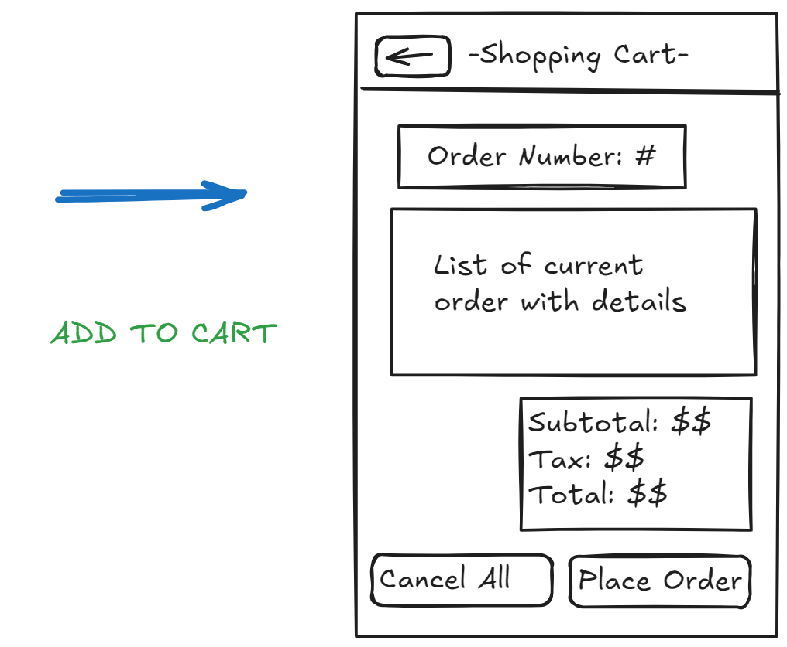

---

## **Scenario: Didn't choose drink option**
- if the user clicks **add to Cart** without selecting a **drink option** 
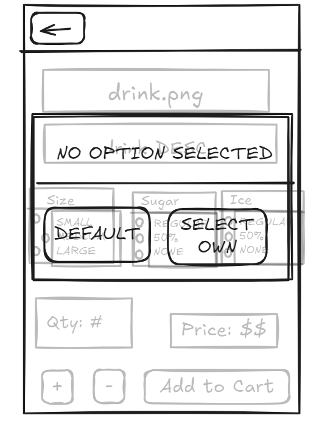

- if the user clicks **add to Cart** without selecting a drink **size** 
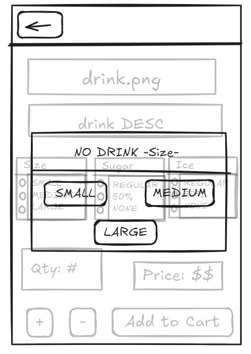

- if the user clicks **add to Cart** without selecting the amount of **sugar** 
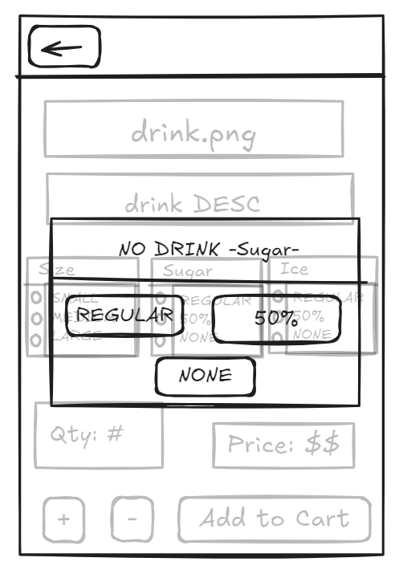

- if the user clicks **add to Cart** without selecting the amount **ice** 
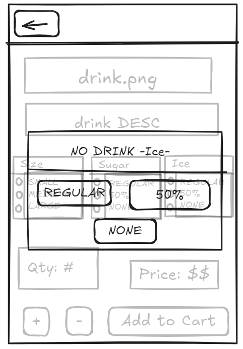

---

## **Scenario: Order Confirmation**
- The user is in **shopping cart**.
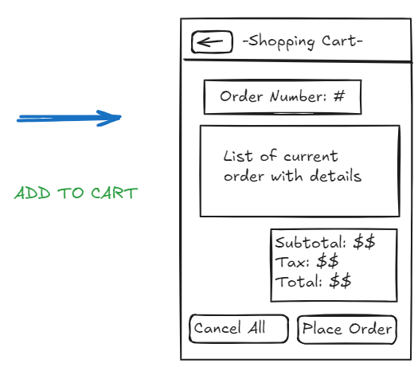

- The user clicks **place order**, then a pop-up appears asking users if they are sure.
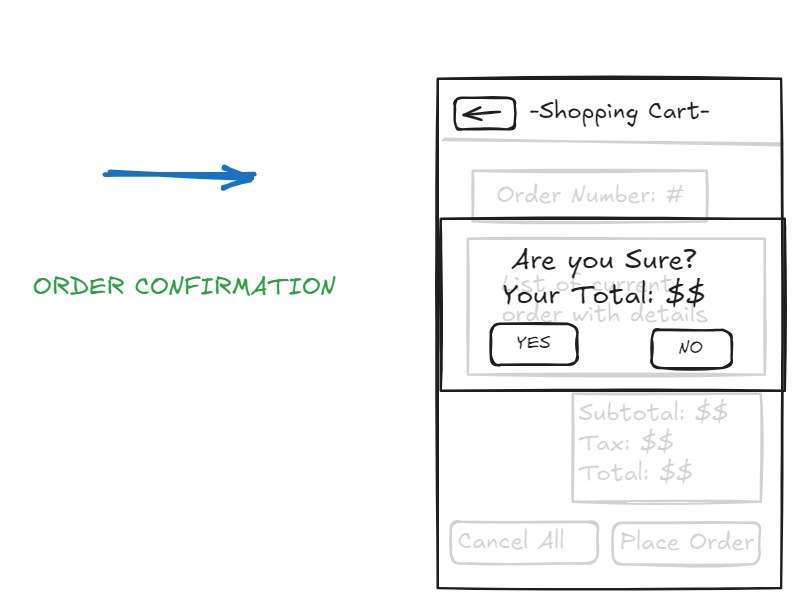

- The user sees a **Green Success** screen.
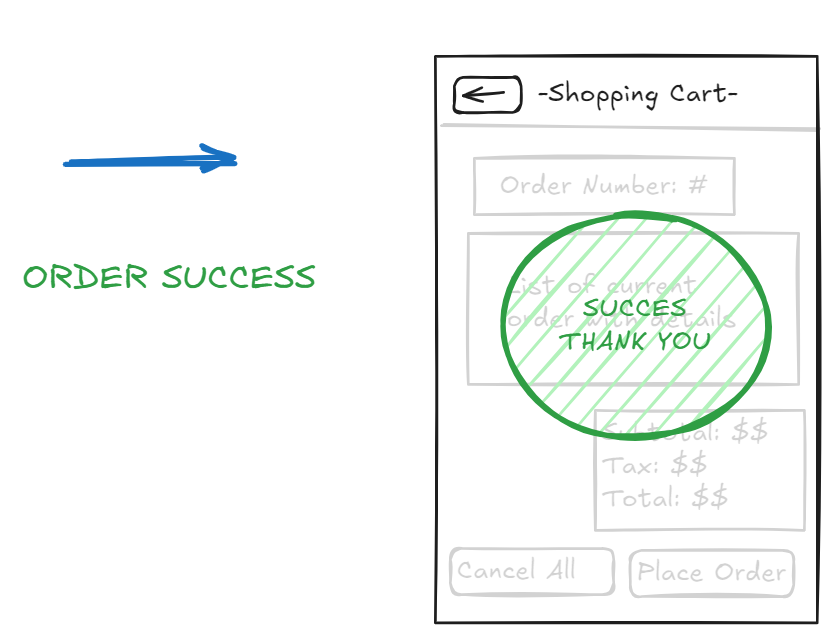

-The user sees their **Order Details**.
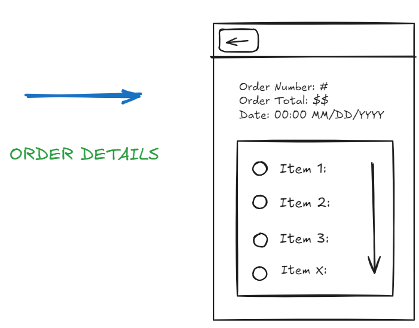

