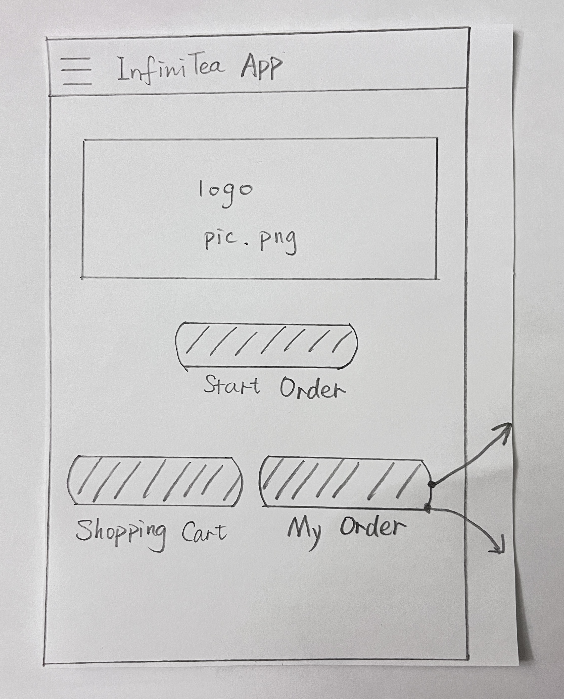
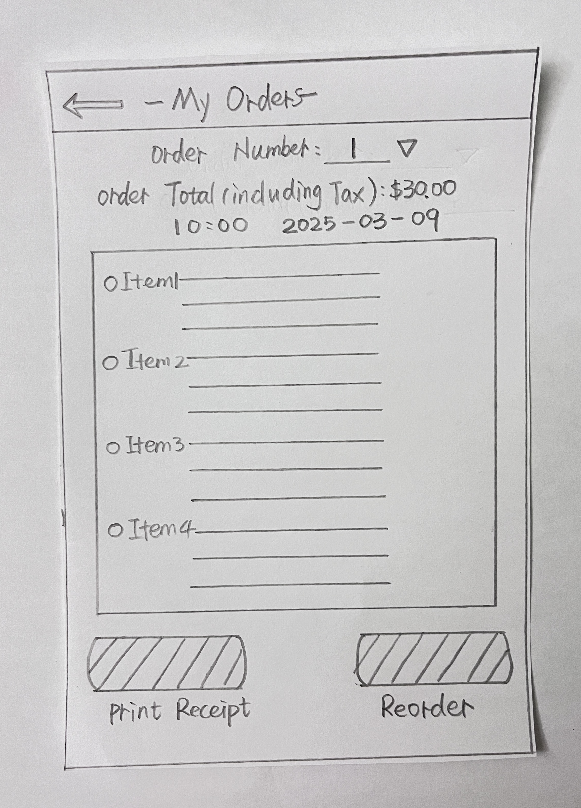
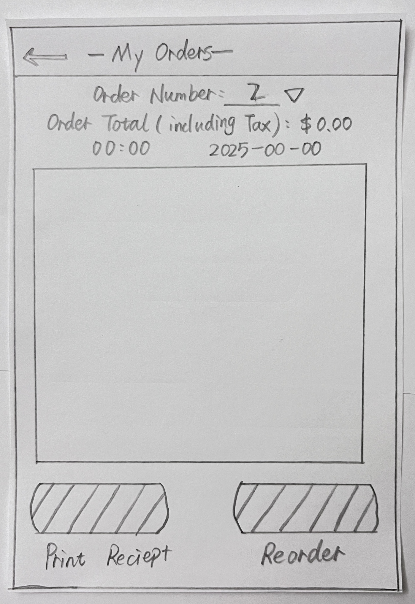
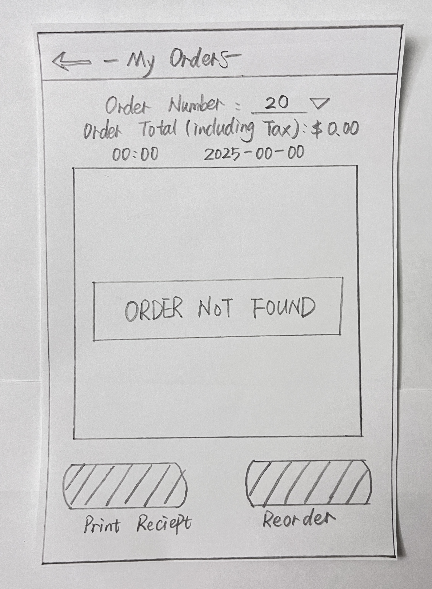
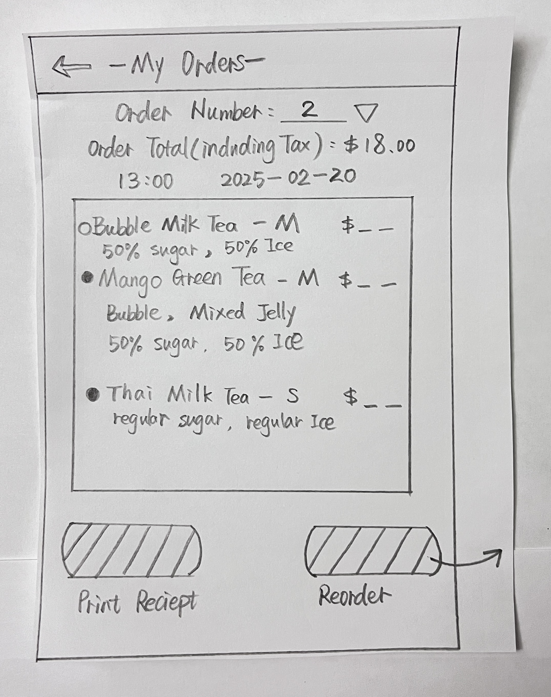
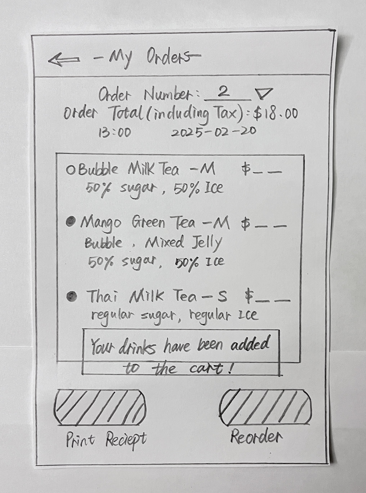
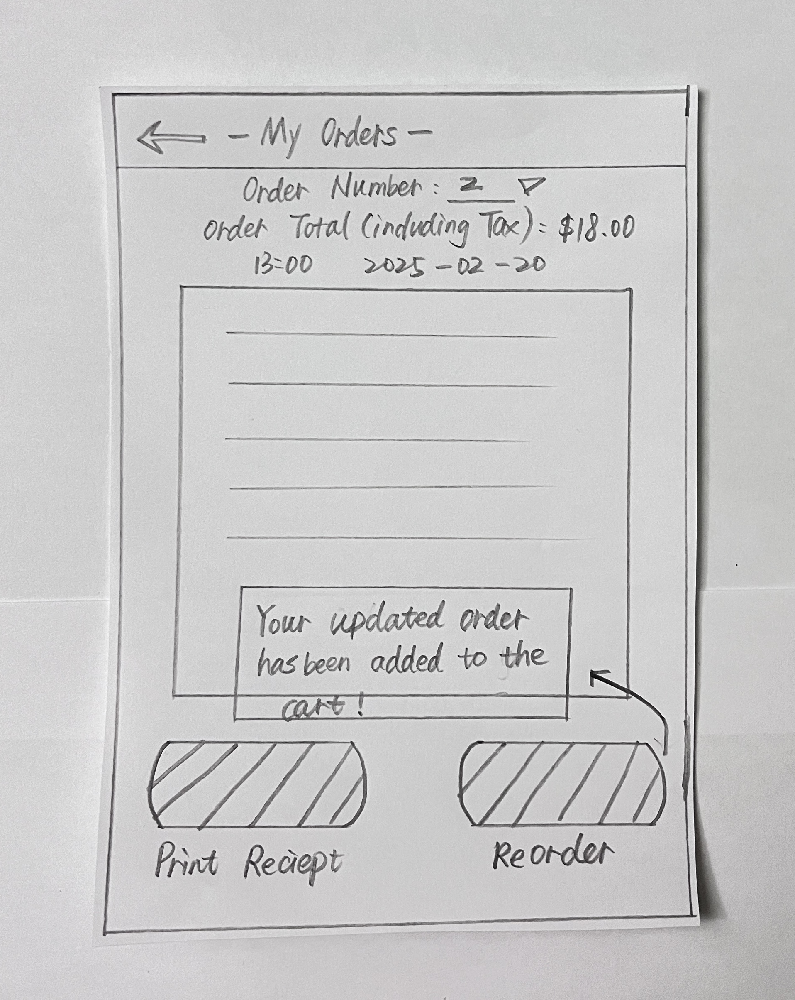

# Storyboard: View and Reorder Past Orders  

## **User Story**

As a customer using the App,  
I want to access my past orders from the homepage and reorder drinks,  
So that I can quickly track my purchases and effortlessly reorder my favorite drinks.
[User Story](../../features/past-order.feature)

## **Scenario: Access past orders from the homepage**

- I open the app, and I am on the homepage, When I tap on **"My Orders"** button.
   

- I should be taken to the **"My Orders" page**
- I should see a list of my **past orders**, if the orders exsit.
  

- If no past orders exist, then an **empty list** is displayed.
  

---

## **Scenario: Search and filter my past orders by order number**

- I am on the "My Orders" page, when I enter an **order number** in the search bar to find a specific past order.
  

- I should see the matching order displayed only
  

  
- if the order number does not exist, I should see the message "Order not found"
  

---

## **Scenario: Select a Past Order for Reordering**

- I am on the "My Orders" page, When I select a **previously placed order** in the list that I want to reorder, then I tap the "Reorder" button
  

- The system checks the **availability of all items**, then the same drinks with the same customizations should be added to my shopping cart, and I should see a confirmation message - "Your drinks have been added to the cart!"
  

---

## **Scenario: Handle Out-of-Stock Items**

- I am on the "My Orders" page, when I select my favorite drink from the list, if an item is **out of stock**, the system should show a warning message - "items are out of stock".  Then I can choose to **unselect the drinks to cancel the reorder** or **proceed with available items by tapping the reorder button**.
  

- When I tap the "Reorder" button, and the order is successfully **added to the shopping cart**. I should see a confirmation message - **"Your updated order has been added to the cart!"**
  

